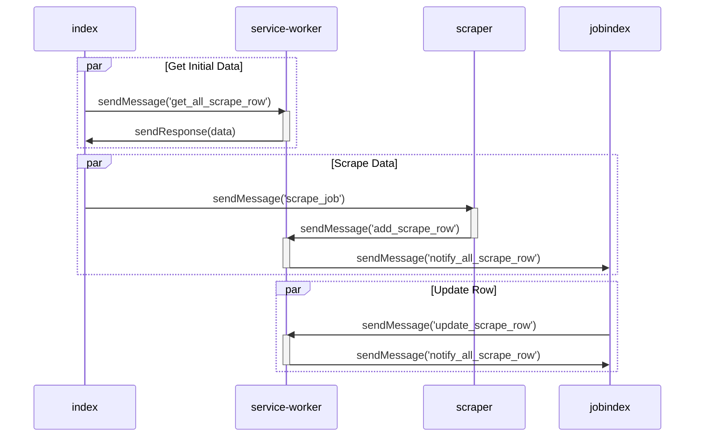

## JIS(JOB-INDEX-SCRAPER)-Chrome--Extension
### Description
This extenstion lets users scrape job description from LinkedIn and Indeed. In future it will support other job boards (Ex: Monstar, Glassdoor).
### Installation Steps
- Clone this repo with command `git clone https://github.com/alvi1316/JIS-Chrome-Extension.git`.
- Open chrome and go to `chrome://extensions/`.
- Enable developer mode.
- Click `load unpacked` button and select root folder of this repo.
- Restart browser.

### How To Use
- To see the instruction about how to use the extention view [HOW_TO_USE.md](./HOW_TO_USE.md).

### Sequence Diagram
- The extension has `service-worker.js` that is running in the background and responsible for reading and writing data.
- The extension has `linkedin-scrapper-1.js` and `linkedin-scrapper-2.js` which are responsible for scraping content from the webpage. We will be adding more scrapers for other job boards.
- The extension has `index.js` which works with `index.html` as a popup script to handle UI events.
- The extension has `jobindex.html` and `jobindex.js` responsible for searching and updating existing data. 

